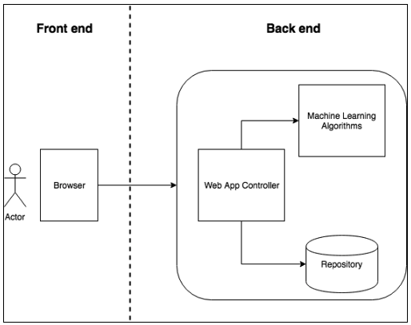
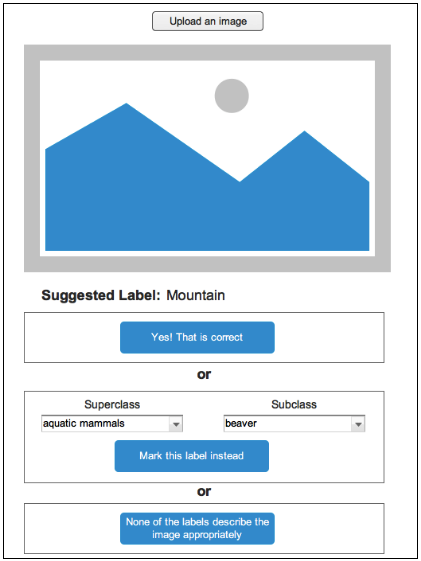

# Computer Vision Capstone Project Proposal

## Domain Background

Image recognition now is accessible to every programmer. The tools and libraries that are available implement complex algorithms and have easy to use APIs. I have a solid background as a web developer and today I feel I have the tools and knowledge at hand to tackle computer vision problems that I thought were exclusive for people with PhDs.

A good example of existent tool that can help us to solve computer vision problem is [OpenCV](http://opencv.org/). Using OpenCV with a combination of other Python libraries focused on data analysis, like [Pandas](http://pandas.pydata.org/) and [Numpy](http://www.numpy.org/), simplify our work a great deal.

Even though we have those great tools at reach, classifying images can still be very challenging. I believe the real difficulty lies on the fact that there a nearly infinite dataset to work with. The combination of elements that can be part of a certain image is incalculable, so we cannot have a learning data set that covers all possible images that we can think of.

There are many examples of machine learning being used to solve computer vision problems, and it's not hard to find applications that incorporated CIFAR-10 and CIFAR-100 as the dataset. One interesting instance of such project is a competition held by the website [Kaggle](https://www.kaggle.com/c/cifar-10). The goal of this competition was to create an algorithm that predicted a label for a given image. Another excellent example of algorithm that used the CIFAR-10 dataset is the [study performed by Rodrigo Benenson](http://rodrigob.github.io/are_we_there_yet/build/classification_datasets_results.html#43494641522d3130).

## Problem Statement
The problem I am going to solve in this project is: classify an image among the 100 lower level classes, defined by [The CIFAR-100 dataset](Learning Multiple Layers of Features from Tiny Images, Alex Krizhevsky, 2009.). So this is a multi class classification problem.
The input would be a image with a minimum dimension of 100px by 100px.

## Dataset and Inputs
I am going to use the CIFAR-100 dataset. This dataset is publicly available at the [University of Toronto website](https://www.cs.toronto.edu/~kriz/cifar.html). It is comprised by 6000 small images correctly labeled with one of 100 available classes.
The CIFAR dataset is a subset of the [80 million tiny dataset](http://groups.csail.mit.edu/vision/TinyImages/), and all the images have a 32x32 dimension. Those are quite small images, but I don't believe this would be an issue while training the model.
The input images will have variable dimensions, the only constraint being that the image should be at least 32x32 in dimensions.

## Solution Statement
The main deliverable from this project will be a web based application that will allow users to upload an image and will try to label that image accordingly.
I am going to use [Convolutional Neural Network (CNN) algorithm](https://en.wikipedia.org/wiki/Convolutional_neural_network) with the aid of the [Keras library](https://keras.io/). The images would probably be converted to grayscale before processing, so we could work with fewer dimensions.

## Benchmark Model
Our benchmark will be to provide better results than the Support Vector Machine (SVM) algorithm.

## Evaluation Metrics
Since we are dealing with a perfectly balanced dataset (CIFAR-100 has 600 images labeled on each of its 100 lower level classes), I am going to propose using accuracy as the evaluation metric.

## Project Design
I am going to build a web application that allows users to upload images and tries to label them according to the CIFAR-100 dataset.
The front end would deal with basic navigation, image uploading, classifier input and would rely on services exposed by the back end.

## Wireframes
I intend to create a very simple application with only 1 view where the user can upload the image, then suggests a label based on the machine learning algorithm, and allows the user to either mark the suggestion as correct, select a more appropriated label, or indicates that none of the labels describe the image correctly:

## Machine Learning Algorithms
I am going to use Keras library to apply a Convolutional Neural Network algorithm to the problem. The detailed steps are listed below:

##### Training phase

1. Convert all 6000 images to 3 dimensional Numpy arrays using OpenCV
2. Convert images to grayscale to reduce the array to 2 dimensions
3. Train the dataset using Keras API

##### Classification phase

1. Convert uploaded image to a 3 dimensional Numpy array using OpenCV
2. Convert the image to grayscale to reduce the array to 2 dimensions
3. Classify the image using Keras API
